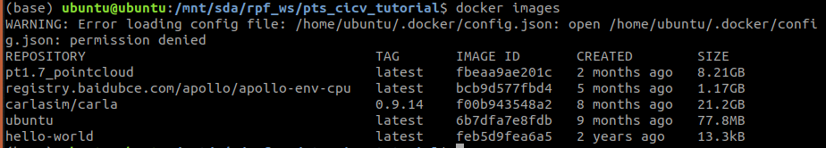
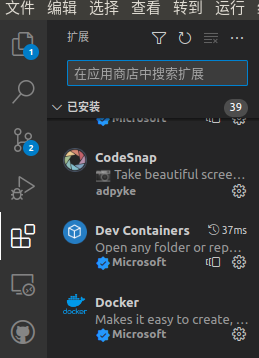
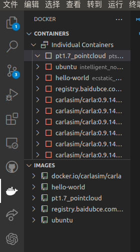
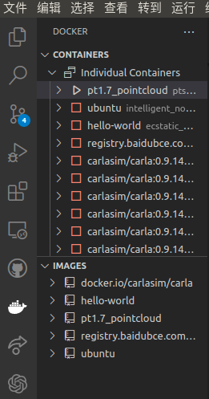
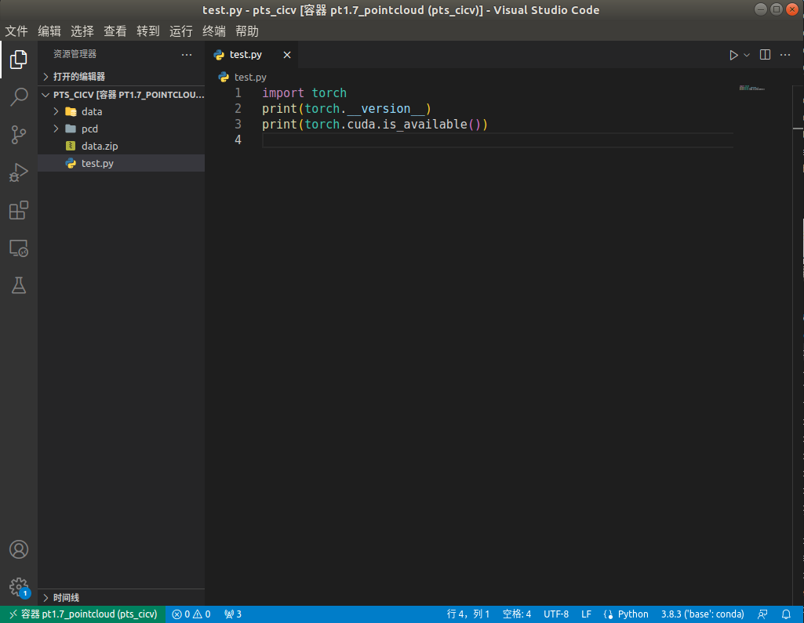
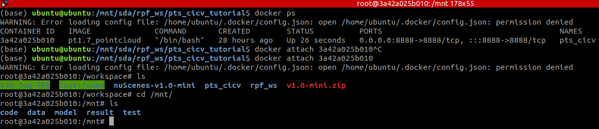

# docker
简单解释下docker，可以理解为容器技术。
最常见的问题，就是一套代码在自己的电脑上可以跑，但是复制到别人的电脑上因为环境的原因，就运行不起来，这很影响效率，所以就出现了docker。
可以将其理解为，将运行代码的环境，也就是运行代码所需要的包都存在一个容器里。然后将这个容器一起移植到别人的电脑。
docker中常见的一些定义：
1、image-->不是图片，是镜像的意思
2、container-->容器的意思
3、仓库（这个可以先不用管）
他们之间的关系就是容器是镜像的实例化，也就是说，想要拿到一个容器，首先要做的就是拿到这个容器的镜像，然后将其实例化得到容器。
所以一个镜像其实是可以创建多个容器的。
```ruby
docker images#查看镜像有什么
```

上图中pt1.7_pointcloud就是已经加载进来的镜像。加载方法如下：
```ruby
docker load < 文件路径#文件路径指的是镜像的路径（镜像是官方提供的，从网上下载的）
```
然后系统存在镜像之后，就需要创建容器，然后进入容器就可以拉。
```ruby
docker run --gpus all -it -p 8888:8888 -v /home/whaow/:/workspace 镜像的名字
```
上面```/home/whaow/:/workspace```表示的是文件路径的挂载。也就是说，你可以理解为进入了容器，就进入了新的系统，这个系统什么文件都没有，我们需要将本机的文件通过一种方式指定到容器中。
### 使用
上面的一些你可能用不到，但是下面的就有用了。
首先，我们有了容器如何将其布置到vscode中使用。
第一种方法就是在容器安装一个vscode的包，然后通过qt等操作。
第二种通过vscode进行调用。
这里只说第二种。
很简单，首先vscode安装两个插件:dev containers 和 docker

然后你就会发现左侧有一个鲸鱼的图标。

你就会发现很熟悉的images和containers,因为我们创建了容器，所以在containers中会有一个pt1.7_pointcloud的容器，右键点击然后start就可以打开容器。

启动之后，会发现那个容器前面的正方形表成了三角形，然后继续右键选择“附加visual studio code”，之后就会出现一个新的vscode窗口。

窗口左下角会有docker的介绍。注意，我们的开发路径是在docker中的/mnt下进行的。目前已经将data移动到目录下啦。
补充一句，想要在终端进入docker，命令如下：
```ruby
docker ps -a # 查看所有容器
docker ps #查看start的容器
docker attach 容器id #进入容器
```
